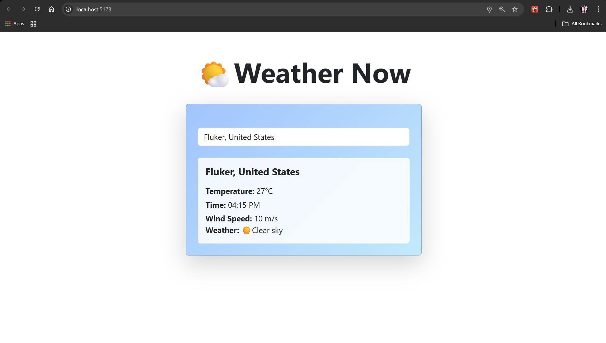

🌤 Weather Now
A simple and responsive weather application built with React + Vite + Bootstrap.
It allows users to quickly check the current weather conditions for any city using the Open-Meteo API.

🚀 Features
-City Search with AutoComplete (powered by Open-Meteo Geocoding API)
-Detects your current location using browser geolocation
-Shows temperature, weather condition (with emojis), wind speed, and time
-Responsive design (works on desktop & mobile)
-Clean UI with Bootstrap styling

🛠️ Tech Stack
React + Vite – Frontend framework & bundler
Bootstrap – Responsive UI components
React-Bootstrap – Bootstrap components for React
Open-Meteo API – Weather and geocoding data

🌍 APIs Used
-Weather Forecast API
 https://api.open-meteo.com/v1/forecast?latitude={lat}&longitude={lon}&current_weather=true
-Geocoding API 
 https://geocoding-api.open-meteo.com/v1/search?name={cityName}&count=5

📸 Screenshots

🧑‍💻 Author
👤 Nigamanjani Kompella
📧 knigamanjani22@gmail.com
